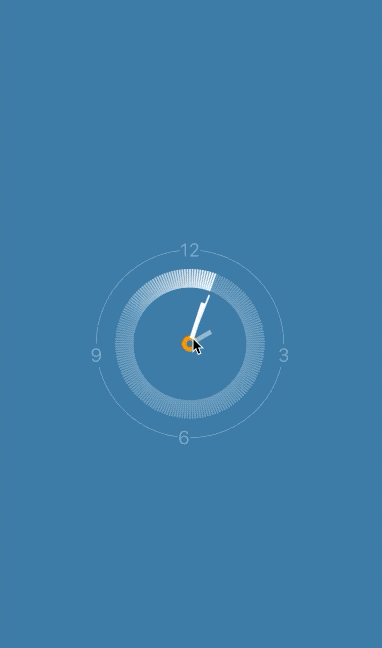

# flutter_animations

flutter动画，纯dart语言写的动画，让动画用起来更简单,每个效果都有例子共读者更好的使用。


## 动画集合


|  <br/> 声音|  <br/> 音乐跳动| <br/> 魔法|
|:-:|:-:|:-:|
|</br>破碎的红点|</br>默认无效果页面|</br>3dclock|

 
 

## 配置`pubspec.yaml`

```dart
 flutter_animations: ^*.*.*
 
flutter pub get 

import 'package:flutter_animations/flutter_animations.dart';

```

> ⚠️ 注意： 具体版本[点我查询](https://pub.flutter-io.cn/packages/flutter_animations)

# 示例
> 每个动画斗鱼简单的例子。

## SoundWidget 声音

```dart
SoundWidget(
  color: Colors.green,
  lines: 4,
  lineWidth: 2,
  centerFill: true,
  stop: _isStop,
  soundDirection: SoundDirection.top,
)
```

##  Chakra  音乐跳动

```dart
Chakra()
```

## Spinnies 魔法

```dart

Spinnies(duration: Duration(seconds: 6), blendMode: BlendMode.screen)
```

## BrokenRedDot 破碎红心

```dart
BrokenRedDot(radius: 10),
```

## FlashPage 闪光

```dart
FlashPage();

```
### 属性

```dart
/// 闪光 偏移量 x：横轴 [-1,1] y:纵轴[-1,1]
final Offset offset;

/// 闪光的颜色
final List<Color> colors;

/// 闪光步长，数组长度保持和[colors]一致
final List<double> steps;
```

## 3D 时钟

```dart
  /// 圆圈颜色
  final Color circleColor;

  /// 圆圈周围分割线颜色
  final Color clockLinesColor;

  /// 中心颜色
  final Color centerColor;

  /// 秒针颜色
  final Color secondHandColor;

  /// 时针颜色
  final Color hourHandColor;

  /// 分针颜色
  final Color mintueColor;

  /// 背景颜色
  final Color backgroundColor;

  /// 高亮分割线颜色
  final Color lightclockLinesColor;

  /// 秒针画几个格子,最好是12的倍数例如[12,24,48,96,108,120,132,144,156,180]
  final int numbers;

  /// 12 3 6 9 样式
  final TextStyle textStyle;

  /// 范围[0,2π] 高亮尾巴长度
  final double tailLength;
```


## [收藏✨✨不迷路](https://github.com/ifgyong/flutter_animations)
## [MIT License](LICENSE)
