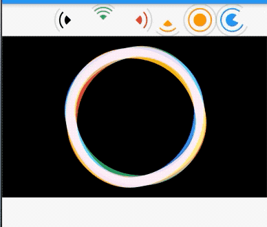
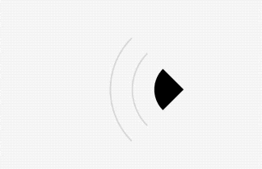
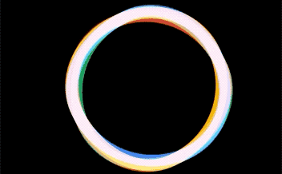
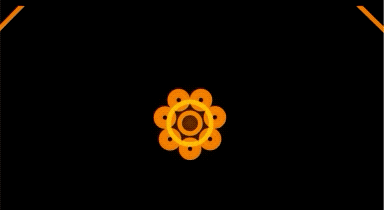
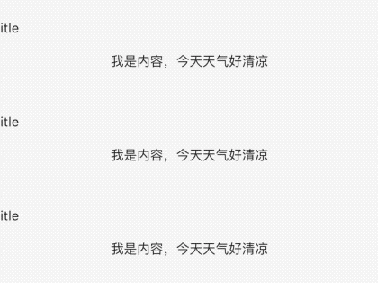

# flutter_animations

flutter动画，纯dart语言写的动画，让动画用起来更简单,每个效果都有例子共读者更好的使用。


## 动画集合




|  <br/> 声音|  <br/> 音乐跳动| <br/> 魔法|
|:-:|:-:|:-:|
|</br>破碎的红点|

 
 

## 配置`pubspec.yaml`

```dart
 flutter_animations: ^*.*.*
 
flutter pub get 

import 'package:flutter_animations/flutter_animations.dart';

```

> ⚠️ 注意： 具体版本[点我查询](https://pub.flutter-io.cn/packages/flutter_animations)

# 示例
> 每个动画斗鱼简单的例子。

## SoundWidget

```dart
SoundWidget(
  color: Colors.green,
  lines: 4,
  lineWidth: 2,
  centerFill: true,
  stop: _isStop,
  soundDirection: SoundDirection.top,
)
```

##  Chakra

```dart
Chakra()
```

## Spinnies

```dart

Spinnies(duration: Duration(seconds: 6), blendMode: BlendMode.screen)
```

## BrokenRedDot

```dart
BrokenRedDot(radius: 10),
```

## [收藏✨✨不迷路](https://github.com/ifgyong/flutter_animations)
## [MIT License](LICENSE)
